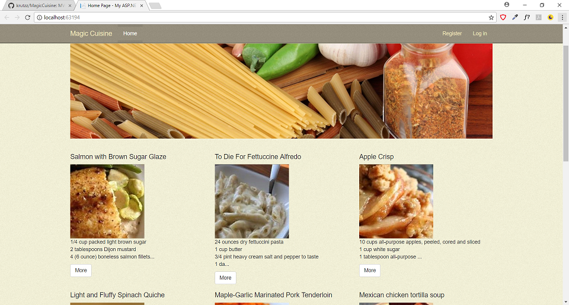
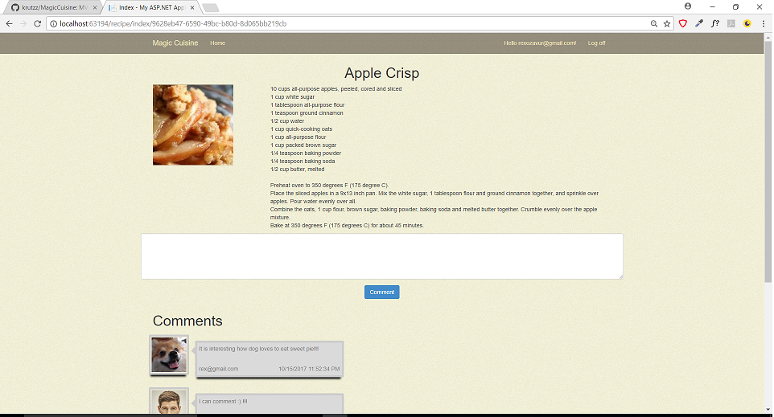
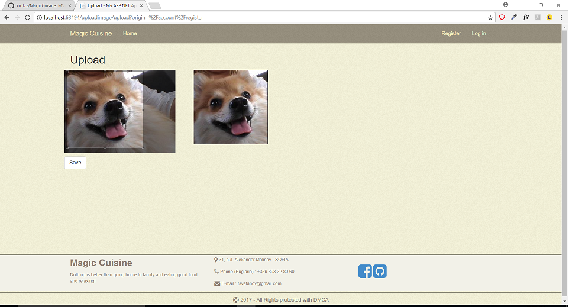
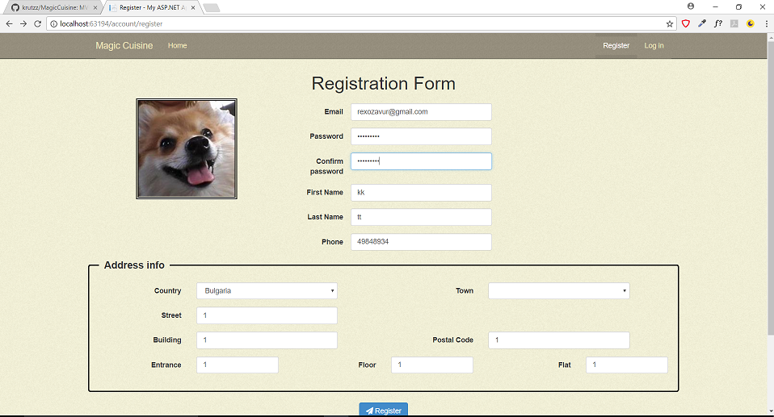
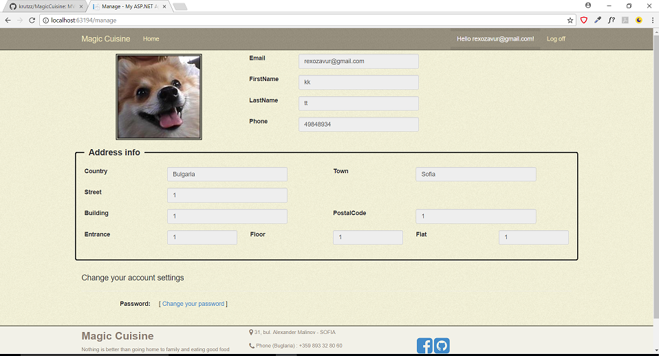
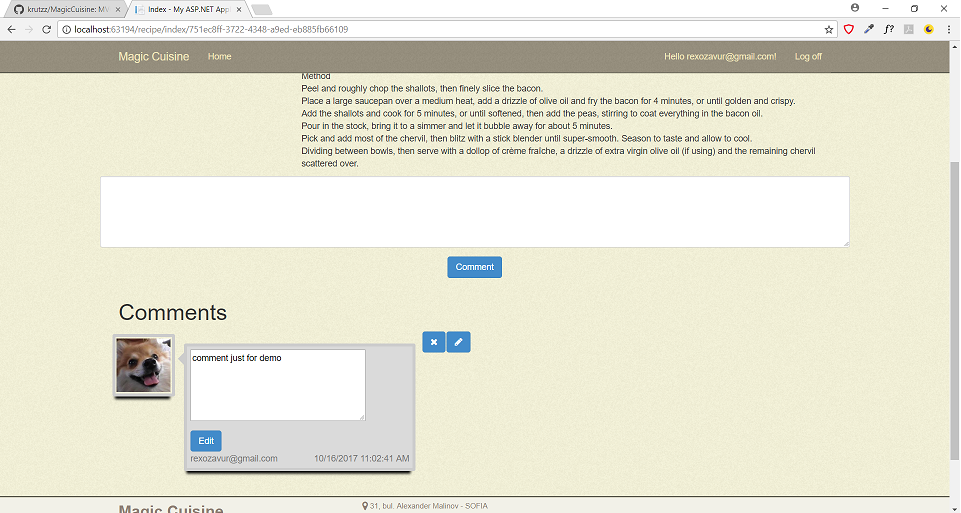
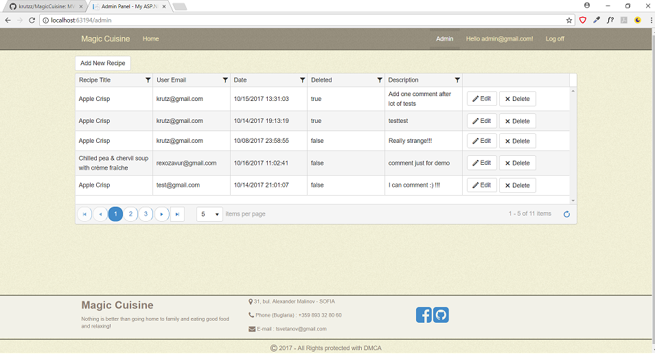

# MagicCuisine
MVC final student project

MagicCuisine is personal blog post site for recipes.

# IN BRIEF
#### Public part
  - Home
    - List of all posted recipes
    
  - Recipe detail page
    - Ingredients, Method and Comments
    
  - Registration
    - Upload profile avatar
    
    - Registration form
    
#### Authenticated part
  - User account
    - User profile page
    
    - edit/delete comments
    
#### Administration part
  - Admin panel page
    - Admin panel page
    

#### Main functionality
  - User
    - upload avatar
    - new registration form
    - add/edit/delete own comments
  - Admin
    - add recipes
    - edit/delete all comments
